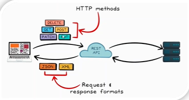
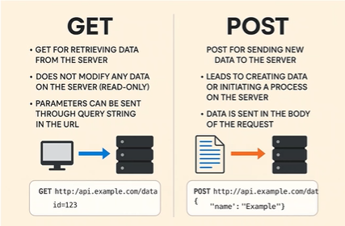
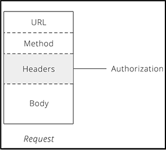
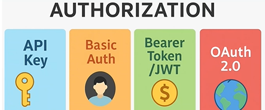
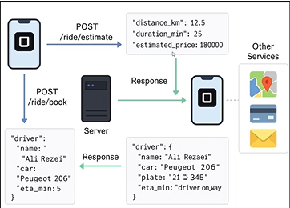
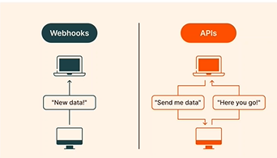

# AI agent Course 
This repo is the summary of AI agent course I took from [maktabkhooneh](https://maktabkhooneh.org/)

##### The final goal of AI_agent course is to make a personal AI_agent from scratch for doing personal tasks

## chapter 1: Python

In n8n we sometimes need to write a function node, This is written in Javascript, but we need to write it as a python node in order to e.g., read a csv file, analyse it with pandas, cleaning or normalizing it before sending to a LLM, or use a local pretrained_model. With Python we will have lots of customized features.
N8n is for automated running of Agents, however, developing and testing Agent itself is always conducted in Jupyter notebooks or colab.
Without Python we will remain a user, not a designer or developer.

To start we need a IDE (Integrated development environment). VS code we use. 

Both Jupyter notebook and Jupyter Lab gives us iPython or interactive python as web based IDEs.


#### lambda function
```python
lambda arguments: expression
lambda x, y: x+y

my_square_func = lambda x: x ** 2
print(my_square_func(4))  
```

#### Map function
``` python
numbers = [1, 2, 3, 4]
squares = list(map(lambda x: x**2, numbers))
print(squares)  
```

#### Filter function
``` python
numbers = [5, 12, 17, 24, 3]
evens = list(filter(lambda x: x % 2 == 0, numbers))
print(evens)
  
```

#### Sorted function
``` python
people = [("Ali", 25), ("Soheil", 35), ("Reza", 20)]
sorted_people = sorted(people, key=lambda person: person[1],reverse=True)
print(sorted_people)
  
```

pip install packages from pypi.org 


## chapter 2: AI agent, chatbot, Agentic AI, and n8n

AI agents are good to have these days, we will compare them to chatbots and also we will define Agentic AI.

AI agent: a software layer that would do us some repetitive tasks and frequently (They won't need access level and won't need much thinking). 

```plaintext
Agentic revolution: Cloud  -->  SaaS
                    Mobile -->  App
                    Agents --> Agentic Economy
LLMs will be used in Agent AIs.
```

There was chatgpt moment at 2022. Now is AI agent moment for us. They are all like personal agents for us. 
There are different Agents: Customer Agents, Employee Agents, Creative Agents, Data Agents, Code Agents, Security Agents

LLMs give rise to the Agentic economy.

#### agentic AI and AI agent

AI agents would do the repetitive tasks daily but for those who need human feedback or human intervention still no. 
In agentic AI, agents do everything and find the task they should do. We are still far from that. but AI agents are great now at doing defined tasks such as checking, tagging emails...
All of these are possible with LLMs and the connection to LLMs. 

A use case: search through web pages are now mostly done by agents. 

Some tasks still need human feedback such as LLM-chatbots they use RLHF protocol. 
So, there is a distance between AI agents and agentic AI.
The goal of this course is to have our own Ai agents after this for doing our tasks,

#### n8n, Dify and Flowise AI
In this course what we will learn mostly is n8n, because of  it is open source and we can use in our local machine (not cloud). All the environment of three tools are graphic "drag and drop" env. n8n is much simpler in connecting to different APIs such as telegram, slack, email,.... It also has larger community (check all three githubs).

The license of other two are apache 2.0 but for n8n is sustainbale use license. If we want to make a chatbot + LLM , defy or flowise would be better. But not to forget all three needs zero or less coding compared to tools such as langchain,.... Those give us more freedom btw.


## chapter 3: LLM and propmt engineering

LLMs: A neural network with millions of parameters. 

The more sentences the LLM saw, the better they predict the next token not based on reasoning, That is why we are far from agentic world.

Token: each unit in the sentence where has to converted to a vector. Then based on the content the LLM saw and trained on, the words will be predicted with different probs.
And this sequence will continue. LLM does not understand of generated words, but If it has the reasoning ability, then it would create agentic world.

#### Challenges: 

- Hallucination
- Data dependency (garbage in, garbage out)
- Security 
- Privacy


What we want is to connect different tools and filesystems together and use LLMs(chatgpt) as the brain.
Chatgpt has this ability now.
AI agent will be our colleague or assistant, where it will 
1. learn pattern from data, 
2. generate new content,
3. categorize data and tasks and,
4. do smart follow up and remind.


The most updated LLMs now: 

- GPT (OpenAI) general applications.
- Gemini (Google) Better in research area and less biased good together with other google tools such as notebooKLM
- Grok (xAI) More social realtime events
- Claude Sonnet (Anthropic): Code developing
- DeepSeek Give lots of unnecessary info

Prompt engineering:
The best way to ask questions from LLMs. 

1) Ask clear question
2) Always check the output
3) No private data

Prompt is very important, because the generated text is based on our prompt. The prompt engineering is like ordering food in a restaurant.

prompt engineer tasks:

- Design smart prompts to get the best output from AI models
- test and improve prompts for increasing quality
- convert the customer need and applications to a meaningful prompt
- prompt documentation and make a library out of best prompts
- technical and non-technical collaboration for better promp designing


Good Prompt has:

1. What (e.g., write, summarize, suggest,...)
2. How (e.g., for who, official, friendly)
3. Limits (e.g., in less than 100 words, ..)

We can use some tools to convert the voice to text in our own language and this could be the prompt.
We can even ask the LLMs to give us a prompt.
Also we can ask for the edits in an image and upload the image with the prompt to the LLMs.

The course project for this chapter involved prompting an assistant by providing detailed information about the role, abilities, and preferred answer style. By modifying the details of the prompt, we were able to compare the outputs and explore how prompts can be shaped effectively, illustrating the principles of prompt engineering. The source files for this project are provided [here](src/Prompt_engineering_chapter/).


## chapter 4: API and applications

Application programming Interface: API helps to different apps and softwares to talk to each other.

Applications:

- Receive data fro online services
- Send data to online services
- interface between backend (service) and frontend (application/customer)


##### API Design and Architecture

| Example                   | Description                                      | API Type |
| ------------------------- | ------------------------------------------------ | -------- |
| Instagram API, GitHub API | Popular public APIs based on HTTP and JSON       | REST API |
| Facebook API              | Retrieve exactly the data you request            | GraphQL  |
| Google Cloud Services     | Fast communication between services using HTTP/2 | gRPC     |
| Banking & Insurance APIs  | Older protocols using XML with strict standards  | SOAP API |


##### API connection protocol

| Example                    | Description                                                     | API Type      |
| -------------------------- | --------------------------------------------------------------- | ------------- |
| Web services               | Standard request–response over HTTP/HTTPS                       | HTTP API      |
| Chat apps, Trading systems | Real-time, two-way communication                                | WebSocket API |
| Microservices              | Fast, lightweight service-to-service communication using HTTP/2 | gRPC API      |
| Smart sensors (IoT)        | Lightweight messaging for IoT devices                           | MQTT API      |


Here we will use REST APIs.


#### Why do AI agents need APIs?

When building AI agents, we often use workflow automation tools like n8n to connect different services and automate tasks. For example, we may need to retrieve data from Google Sheets and send it to Telegram. To enable this communication between systems, we rely on APIs.

APIs allow different applications to exchange data and trigger actions programmatically. Without APIs, tools like n8n would not be able to integrate external services into a workflow.

For the intelligence layer, we use LLM APIs (such as OpenAI or similar providers). These models act as the brain of the system, processing prompts and generating responses. Since the models run on external infrastructure, we access them through their APIs using API keys.

In summary:

- APIs connect external services (Google Sheets, Telegram, databases, etc.)

- Workflow tools like n8n orchestrate the process

- LLM APIs provide the reasoning and decision-making capabilities for the AI agent

#### API methods, GET and POST

Rest API works on HTTP protocol. 




The main methods of HTTP are:

- GET: retrieve new data(e.g.,  user list) from a server, readonly. 
- POST: Send new data (e.g., create new user)
- PUT: Fully update (e.g., update or change in a user's profile)
- PATCH: Partially update.
- DELETE: Remove data.

Two ways to work with GET:
```plaintext
https://api.weatherapi.com/v1/current.json?key=API_KEY?q=Lund
```

or using python
```Python
import requests

url = https:/api.weather.com/v1/current.json.get()
print(requests.get(url))
```

How to build a JSON URL (general rule):

A JSON API URL usually has:
```plaintext
https://api.website.com/endpoint?param=value&param2=value
```
1. Find the API base URL

2. Add parameters using ?

3. Separate parameters with &

4. Use response.json() in Python


in POST method we have data to add and send.



[Here](src/API_chapter/api-get.py), we run a test case of connecting to the coingecko.com api to get bitcoin values.


Now, we try [POST](src/API_chapter/api-post.py) method. use [jsonplaceholder](https://jsonplaceholder.typicode.com/)" url.

We can see the get and post signals in the network tab (F12) in all websites that we browse. 


#### API and authorization

API response status code categories:

- 1xx - informational
- 2xx - Success 
- 3xx - Redirection
- 4xx - client Error
- 5xx - Server Error



All types of authorization:

1. API key in the header
2. Basic Auth: username and password
3. Bearer Token (JWT) : The most common way, use a signed token 
4. OAuth 2.0 : Facebook



#### cURL

Client URL is a command line tool for sending HTTP requests and other protocols (e.g., FTP)
It exist on Windows, Mac, and Linux.
For API test and scripting is very important.

```plaintext
curl -X GET https://api.example.com/servers
```

curl -X : command to make a API call from command line

GET     : HTTP method used for the call

https.. : URL or endpoint where the information is available

```plaintext
curl -X POST https://api.example.com/data -H "Authorization: Bearer YOUR_TOKEN" -d "{"sample":"data_body"}"
```

curl -X : command to make a API call from command line

POST     : HTTP method used for the call

https.. : URL or endpoint where we want to write the data

Auth    : Header

-d JSON : Data


API testing software: Postman.

To try API we can use:

1. Python with requests package
2. curl as a command line tool

Online Taxi App:



#### Webhook
Webhook is a URL in our server that if an event happens, the other server will send a request to it. 
Push: We wait to receive the message from server.

Examples:

Online payment: When the payment is successful, the payment server send a message to our webhook saying successful payment.

GitHub: If someone creates a new issue, Github POST the issue to our webhook. 

When we make an API call, we send a request and ask. INn webhook the response if not from our side. The server send us the message if some changes happen.

|Feature                     | Webhook                             | API                                   |  
| -------------------------- | ----------------------------------- |---------------------------------------|
| Direction                  | Notification from server            | request from us to Server GET/POST    |
| Model                      | Push                                | Pull                                  |
| Speed                      | Real-time                           | Based on request frequency            |
| Example                    | Receive notif when a new order comes| get the order list from online shops  |




## chapter 5: Installation of n8n

## chapter 6: RAG and VectorDB

chapter 7: projects


chapter 8: MCP and applications
